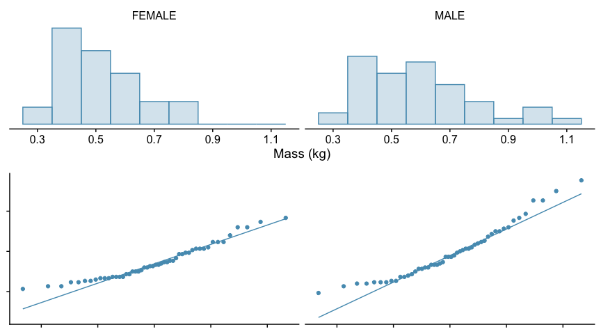

A primer in statistics
================

Based on the very helpful revision chapter in [Modern Statistics for the
Life Sciences, Alen Grafen and Rosie Hails,
OUP](https://global.oup.com/ukhe/product/modern-statistics-for-the-life-sciences-9780199252312?cc=gb&lang=en&).

### Populations and samples

It is rarely possible to get an exact answer to a question. Normally we
have to make do with an estimate, and this may vary from a rough
estimate to a more precise one.

One of the first tasks of statistics to state this in more precise
terms.

Suppose, for example, we wanted to know the average height of adult
women between the ages of 25 and 35 in the United Kingdom. It is quite
impossible to measure the height of every single woman of that age.
Instead we must content ourselves with taking a sample, finding the
average height of women within that and hoping that it is representative
of the whole population.

A **sample** is a **random** selection from within a **population**. For
this to be the case the population needs to be precisely defined, since
our sampling strategy will depend on this.

Having taken our sample we compute the mean by summing and dividing by
the number of values:

$$
\\bar{y}=\\frac{\\Sigma y\_i}{n}
$$

This is our estimate of the true population mean, *μ*. It is similar
when we do an experiment. Measurements in an experiment inevitably
involve error, and so we can think of the data readings we actually take
as being a sample from the population of all the readings that could
have occurred. The mean value that we get at the end from our data is
thus an estimate of the true mean *μ*A, which we would only
have obtained if there was no error involved in the experiment.

### Three types of variability: of the sample, of the population and of the estimate.

#### Variability of the sample

As well as the mean, we would like to know how variable our sample is.
This gives us an idea as to how precise our estimate of the population
mean is. Is it a rough one, or a precise one?

Two samples can have the same mean but very different variabilities. For
example if the results for a class of *n*=30 students for a test in
maths ranged from 40 to 70 while those for a test in English ranged from
50 to 60, then both might have a mean of 55, but, clearly, results in
maths would be more variable than those in English.

For any individual score in either test, we can calculate its
**deviation** from the mean of the score for that test, where

deviation = datapoint − mean
If we sum the deviations of the scores from each test from their
respective means, we would find that the absolute value of these
deviations tend to be bigger for the maths test than for the English
test. For both tests, however, the sum of the deviations would be zero,
because of the definition of the mean as the central point, but if the
deviations are squared and summed, we then get a measure of the
variability of each dataset around its mean.

<table class="table" style="margin-left: auto; margin-right: auto;">
<thead>
<tr>
<th style="border-bottom:hidden;padding-bottom:0; padding-left:3px;padding-right:3px;text-align: center; " colspan="1">

Scores

</th>
<th style="border-bottom:hidden;padding-bottom:0; padding-left:3px;padding-right:3px;text-align: center; " colspan="1">

Mean

</th>
<th style="border-bottom:hidden;padding-bottom:0; padding-left:3px;padding-right:3px;text-align: center; " colspan="1">

Sum of deviations

</th>
<th style="border-bottom:hidden;padding-bottom:0; padding-left:3px;padding-right:3px;text-align: center; " colspan="1">

Sum of squared deviations

</th>
<th style="border-bottom:hidden;padding-bottom:0; padding-left:3px;padding-right:3px;text-align: center; " colspan="1">

Variance

</th>
<th style="border-bottom:hidden;padding-bottom:0; padding-left:3px;padding-right:3px;text-align: center; " colspan="1">

Standard deviation

</th>
</tr>
<tr>
<th style="text-align:center;">
</th>
<th style="text-align:center;">
*ȳ*
</th>
<th style="text-align:center;">
</th>
<th style="text-align:center;">
</th>
<th style="text-align:center;">
*s*2
</th>
<th style="text-align:center;">
$s=\\sqrt{s^2}$
</th>
</tr>
</thead>
<tbody>
<tr>
<td style="text-align:center;">
English scores
</td>
<td style="text-align:center;">
$\\frac{1}{n}\\Sigma y\_i=55$
</td>
<td style="text-align:center;">
*Σ*(*y**i*−*ȳ*) = 0
</td>
<td style="text-align:center;">
*Σ*(*y**i* − *ȳ*)2 = 638
</td>
<td style="text-align:center;">
$\\frac{1}{n-1}\\Sigma (y\_i-\\bar{y})^2=\\frac{638}{29}=22.0$
</td>
<td style="text-align:center;">
$\\sqrt{22.0}=4.7$
</td>
</tr>
<tr>
<td style="text-align:center;">
maths scores
</td>
<td style="text-align:center;">
$\\frac{1}{n}\\Sigma y\_i=55$
</td>
<td style="text-align:center;">
*Σ*(*y**i*−*ȳ*) = 0
</td>
<td style="text-align:center;">
*Σ*(*y**i* − *ȳ*)2 = 2219
</td>
<td style="text-align:center;">
$\\frac{1}{n-1}\\Sigma (y\_i-\\bar{y})^2=\\frac{2219}{29}=76.5$
</td>
<td style="text-align:center;">
$\\sqrt{76.5}=8.75$
</td>
</tr>
</tbody>
</table>

In this case, a comparison of the sums of squares is valid, since the
two datasets have the same size. In general though, a larger dataset
will have a larger sum of squares, so for a valid comparison between
unequally sized datasets, a measure that is independent of the size of
the dataset is required.

To get this, all we need to do is take account of the sample size. We
used *n* data points to define the mean, then the same *n* datapoints,
plus the mean itself, to define the variability around the mean. But
from the way in which the mean is calculated, the deviations must sum to
zero. This means that we have only *n*-1 independent pieces of
information about how the sample varies around the mean. Hence, our
final measure of the variability of a data set, which we call the
**variance** and denote as *s*2, is found by dividing the sum
of squared deviations by *n*-1, not by *n*.

$$
s^2=\\frac{\\Sigma{\\left(y\_i-\\bar{y}\\right)^2}}{n-1}
$$

The number of independent pieces of information that contribute to the
calculation of a statistic is called the **degrees of freedom**.

Often, we would like a measure of variability that has the same units as
the data itself. The variance does not, but we remedy that by taking its
square root to find the **standard deviation** *s* of the dataset.

#### Variability of the population

Just as we cannot know the true mean *μ* of a population, but can only
estimate it from the mean *ȳ* of a sample that we draw from that
population, so we cannot know the true variance of a population.
Nevertheless, it is useful to define it, and it is frequently referred
to as *σ*2 (“sigma squared”). Our best estimate of it is our
sample variance *s*2.

A definition of it is that it is the expected squared deviation around
the true mean for all individuals in the population.

#### Variability of the estimate

Having obtained our estimate *ȳ* of the true mean *μ* of a population,
we would like to know how accurate it is. To answer this we will briefly
discuss **Normal distributions**.

##### The Standard Normal Distribution

Many continuous attributes (eg weight, height, width) of a population
are scattered around a mean value in such way that, if you plotted a
histogram of the values, it would have a shape that is approximately
bell-shaped and symmetric and well described by a Normal distribution
(the reasons for this are interesting, but beyond the scope of this
document). Such a distribution is described by two parameters - its mean
(middle value) and its variance (spread). A **standard normal**
distribution is simply a normal distribution with a mean of 0 and a
variance (and therefore a standard deviation, which is the square root
of the variance) of 1. Such a distribution is sometimes referred to as a
*Z* distribution.

Any normal distribution can be converted to a standard normal
distribution by doing two things. Suppose a variable *Y* follows a
normal distribution, with mean 5 and standard deviation 2. First we
subtract the mean from every value. This will have the effect of moving
the whole distribution leftwards on the *x*-axis by 5 units, the mean
value of *Y*, so that it is centred on 0. Then, we divide each value by
2, the standard deviation of *Y*. This will have the effect of squishing
the distribution inwards, giving it a new standard deviation of 1. The
result will be a standard normal, centred at 0, with standard deviation
1. The process of carrying out these two operations is known as
**standardising**.

In summary, in order to convert a variable *Y* that is normally
distributed with mean *μ* and standard deviation *σ*, to a standard
normal *z*, we subtract the mean then divide by the standard deviation:

$$
z=\\frac{Y-\\mu}{\\sigma}
$$

Why would we want to do this? The answer is that the standard normal is
an example of a **probability density function** (or *pdf* for short).
Such functions have particular properties that are useful to us as
scientists. In particular, it is straightforward to calculate what
proportion of any set of observations described by a pdf fall within or
beyond a certain number of standard deviations of the mean.

The total area under a standard normal, as for any pdf, is 1, since it
is a certainty that the random variable it describes takes some value or
other.

The area under it to the right of zero and the area under it to the left
of zero are both 0.5, since the distribution is symmetric about zero.
This tells you that if you had a random variable that was described by a
standard normal, then there would be a 50% chance that it was positive,
and a 50% chance that it was negative. In general, if you take a random
individual from a population and measure the value of some attribute
(such as its height) that is well described by a normal distribution,
then there would be a 50% chance that the value for this individual is
less than the population mean, and a 50% chance that it is greater.

The area under the distribution beyond a distance roughly two standard
deviations (actually, 1.96) either side of the mean totals 0.05, or 5%
of the total area under the curve. This means that if, again, we have a
population for which some attribute is well described by a normal
distribution, then roughly 95% of individuals will have a value of that
attribute that falls within two standard deviations of the mean, and
roughly 5% of them will fall beyond that. Or, put another way, if you
took a random individual from the population, there is a 95% chance that
its value for this attribute would be within about 2 standard deviations
of the mean, and a 5% chance that it would be more than about 2 standard
deviations greater or less than the mean.

Of particular practical importance, if a dataset is normally
distributed, then about 68% of the observations fall with one standard
deviation of the mean, 95% fall within 1.96 standard deviations, about
96% fall with two standard deviations, and about 99.7% (ie practically
all of them) fall within three standard deviations. The plot below
illustrates this.

So much for an ideal normal distribution. A real data set drawn from a
population that is approximately normally distributed would have some
scatter, the more so the smaller the size of the sample. For such a
sample we would find that *approximately* two thirds of the data set is
within one standard deviation of the mean, 95% are within
*approximately* two standard deviations and pretty much all of them are
within three standard deviations.

##### Accuracy of the estimate

We are interested in the population. We want to know its true mean *μ*,
but what we have as our best estimate of this is the mean *ȳ* of a
sample of size *n* that we drew from the population. If we took another
sample from the population of the same size, we would get a different
sample mean, and so on again and again, if we had the time and resources
to repeatedly take sample after sample. So our sample mean is itself a
random variable *Ȳ*, drawn from a population of all possible sample
means. If we drew samples of the same size *n* many times from our
population of interest, the means *ȳ* of these samples would themselves
form a distribution, the so-called **sampling distribution**, and the
mean of *this* we would hope, would be the true mean *μ* of the
population.

The bigger the variance *σ*2 of the population, the more we
would expect our estimate to differ from the true mean, and the less
variable the population was, the closer we would expect our estimate to
be to the true mean. Similarly, if we took a large sample then our
estimate is likely to be closer to the true mean than if we took a small
sample.

If we take these observations together, what we find is that the
variance of the distribution of our estimates is *σ*2/*n*,
and so the standard deviation of our estimate is the square root of this
ie $\\frac{\\sigma}{\\sqrt{n}}$. This is sometimes called the **standard
error of the mean**. This gives us an idea of how precise our sample
mean is as an estimate of the true mean.

#### Example

Suppose the population of grey seals around the coast of south west
England includes 10,000 adult females, whose weights are normally
distributed and in the range 100 - 190 kg. Let this be our ‘population
of interest’. The weights of individuals in this population are
approximately normally distributed with a mean value of 145 kg, and a
standard deviation of 15 kg.

*Note that in reality we would not know the mean or standard deviation
of this population, or how many seals there were in total or whether the
weights of adult females within it were normally distributed (or
distributed any other way).*

A histogram of the weights of the entire population would look something
like this:

Suppose we wanted to know the mean and standard deviation of the weights
of adult female grey seals in this population. Clearly, we could not
find the true value since that would require weighing every seal in the
population, which is impossible, but we could estimate the values by
weighing all seals in a manageable sample that we hope is representative
of the whole population. Suppose our sample were 100 randomly chosen
adult female seals.

In reality, that would probably be the only sample we could get, and so
our estimates *ȳ* and *s* of the true mean *μ* and true standard
deviation *σ* respectively would be based entirely on that one sample.

To get an idea of how accurate our estimate is, imagine we could measure
such samples of 100 seals randomly selected from the population many,
many times over. Each sample would have a slightly different mean. Let
us plot the distribution of some of those samples and superpose on top
of them the ‘normal distribution’ curve that we know is a good
representation of the weights of adult females in the whole population.
(We know this because this is a simulation. In truth, we wouldn’t.) For
each sample, we display its mean *ȳ* and standard deviation *s*.

Notice how all these sample distributions have *roughly* the form of a
normal distribution but that each one is in detail different from the
others. This is the reality of sampling from a population - every sample
will be different - but not *completely* different. All those shown have
roughly the same mean, shown by the dashed line, roughly the same
standard deviation and roughly the same shape.

Note too that these samples are drawn from a population (we happen to
know, because we created it!) whose mean value *μ* is 145 and for which
the standard devation *σ* is 15. In an actual study, we would have
taken, most likely, just one sample, which could have been any of those
you see above. The mean *ȳ* and standard deviation *s* of that sample
would have been our best estimate of *μ* and *σ*.

    ## NULL

Below we contrast histograms of the population, a single sample of size
100 drawn from the population, and the so-called sampling distribution.
That is, the distribution of the means of many samples of size 100 drawn
from the population. Of these, the middle one, that of a single sample,
is the only one we could get in practice.

In this case, the weights of the population are very close to being
normally distributed. The mean is 145 kg and the standard deviation is
15 kg. You can see that the whole population has a weight within two or
three standard deviations of the mean. In practice, we do not usually
know either that the parameter of interest, in this case weight,
definitely is normally distributed, or the mean and standard deviation
of that distribution.

The weights of one sample of size 100 drawn from the population are also
approximately normally distributed with a mean and standard deviation
approximately equal to the that of the population. In practice, we might
often only have only this one sample, so these would be our best
estimates of the population mean and standard deviation and our
judgement as to whether the population was normally distributed would be
based on this one sample distribution alone. With small samples, it can
often be hard to tell, just by looking at this histogram, whether the
data have been drawn from a population that is normally distributed.

(In practice, we might also use other considerations - such as whether
the data were a simple random sample and whether there were no outliers,
and so on.)

The **sampling distribution** is in practice a hypothetical
distribution, since we cannot normally take many samples, each here of
size 100, find the mean of each and plot the distribution of these. But
if we could, this is what we would get. The mean of the one sample that
we actually got is somewhere within this distribution and the true mean
of the population is at the centre of it. A very interesting and useful
thing about this distribution is that it will very likely be normally
distributed, even if the population distribution was not, provided the
sample size is large enough, and it is narrower than the population
distribution. The larger the sample size, the narrower it is. These are
handy facts, since they together mean that its width gives us an idea of
the precision of our sample mean as an estimate of the the true mean.

Some facts of interest about this distribution are:

1.  it is normally distributed (and, if the sample sizes are large
    enough and the samples independent of each other, it probably would
    be even if the underlying distribution of the population were not a
    normal distribution.

2.  its mean is the true mean *μ* of the population.

3.  its standard deviation is narrower than that of the population as a
    whole or of one sample. If the standard deviation of the population
    is *σ*, where *σ* = 15kg in this case, and the samples each had size
    *n*, where *n*=100 in this case, then the standard deviation of this
    sampling distribution is $\\frac{\\sigma}{\\sqrt{n}}$. So in this
    case, the standard deviation of this distribution is 1/10th that of
    the underlying population.

4.  if our sample size had been bigger, the sampling distribution would
    have been even narrower and so our estimate of the true mean would
    have been more precise. That is the benefit of having a bigger
    sample size.

Now, here is the really interesting thing about this distribution. It
tells us about the precision of our estimate *ȳ* that we got from our
one sample of 100 seals of the true population mean *μ*. Look at that
sampling distribution. The true mean is somewhere in there, as is our
sample mean. So whatever this value *ȳ* is that we got from our sample,
we know it is within the width of this distribution of the true mean.
And how wide is this distribution? Well, since it reliably has the shape
of a normal distribution, we know the answer to that. Roughly 95% of the
values on this distribution are within two of its standard errors of the
middle value *μ*. This standard error, remember, is
$\\frac{\\sigma}{\\sqrt{n}}$, where *σ* is the population standard
deviation, our best estimate of which is the standard deviation *s* of
our sample. Our sample mean *ȳ* is our best estimate of this middle
value, so we end up being able to say something like the following:

$$
\\text{...the true mean = }\\bar{y}{\\text{ (our sample mean)}}\\pm 2\\times \\frac{s{\\text{ (our sample standard deviation)}}}{\\sqrt{n}}
$$

We would call this range the **95% confidence interval** for the thing
we wanted to measure - in this case, the mean weight of adult female
grey seals in the population of them around the south west of England.

What we mean by this is that if we repeatedly took a sample of 100 seals
from the population and constructed the confidence interval for the mean
in this way, then the true value would be within the interval 95% of the
time.

Let us explore confidence intervals in more detail…

### Confidence intervals: a way of precisely representing uncertainty

We know that our estimate *ȳ* of the population mean *μ* comes from the
distribution of all possible *ȳ* that are distributed around *μ* with a
variance of $\\frac{\\sigma^2}{n}$, and thus a standard deviation of
$\\frac{\\sigma}{\\sqrt{n}}$. Let us now find the **confidence
interval** from our data. This is the range of possible values for the
true population mean (which we don’t know, remember) that cannot be
rejected at the 5% significance level.

Parameters that have been estimated with great confidence will have a
narrow confidence interval associated with them, while parameters about
which we have less information will have a wide confidence interval.

From the properties of the standard normal distribution, we know that
95% of all such *ȳ* will lie within 1.96 standard deviations of *μ*,
where the relevant standard deviation is that of the sampling
distribution - the distribution of *ȳ*. That means that 5% will not!

This is illustrated below, where, for example, we show the true mean
weight *μ* of adult female grey seals in south west England as a dotted
line and either side of that, estimates of that obtained as the means
from 20 samples, each of 100 seals, with their corresponding 95%
confidence intervals. Note how nearly all of these confidence intervals
do capture the true mean, but that one (in this case) does not.

Hence we can say that, for 96% of the time:

$$
\\mu-2\\frac{\\sigma}{\\sqrt{n}} \\lt \\bar{y} \\lt \\mu+2\\frac{\\sigma}{\\sqrt{n}}
$$

In practice, by convention, we are interested in a confidence level of
95% rather than 96%. This changes the 2 in the above formula to 1.96 -
the confidence level is slightly lower, so the confidence interval is
slightly less wide. Further, we would rather instead state a confidence
interval for *μ* in terms of *ȳ*, rather than as above, so we rejig the
last equation to give:

$$
\\bar{y}-1.96\\frac{\\sigma}{\\sqrt{n}} \\lt \\mu \\lt \\bar{y}+1.96\\frac{\\sigma}{\\sqrt{n}}
$$

This is now our 95% confidence interval for data drawn from a normally
distributed population: the range of values that the true mean *μ* could
take and be consistent with the data at the 95% level.

But there is a hitch…

### The big hitch with confidence intervals - why we use a *t*-distribution

The trouble with the previous expression, as a way of stating the
confidence interval for a parameter such as the mean of some measure of
a population, is that it requires that we know *σ*, the true standard
deviation of of the population, and we don’t know it exactly. All we
have is an estimate of it, ie *s*, the standard deviation of the sample.
So there is some uncertainty in our knowledge of *σ*, just as there is
in our knowledge of *μ* and this results in our 95% confidence interval
for *μ* being somewhat wider than the value given above.

The way this extra uncertainty can be accommodated is by modelling our
data not by a normal distribution, but by a ***t***-**distribution**.
This is similar to a normal distribution in that it is symmetrical, but
it is lower and wider, with heavier tails on either side - which means
that extreme values are more likely than for a normal. It is
characterised by a centre, a scale and a *degrees of freedom* parameter
*df* that can range from 1 to ∞ and which is one less than the number of
data points in the sample: *df* =*n*-1. The precise shape of the
*t*-distribution depends on *df*. For small *df* *t* distributions have
very heavy tails, but as the sample size increases and *df* rises, so
the *t*-distribution becomes taller and narrower and more and more like
a normal distribution, until, for *df* greater than 30 or so, the two
are more or less indistinguishable. This reflects the fact that, the
more data points we have, the more precise our estimate *s* becomes of
the population standard deviation *σ*.

This is illustrated below, where we see *t*-distributions for *df* = 1,
3, 10 and 30 against a standard normal distribution.

To calculate the 95% confidence interval now we need to know how many
standard deviations of the *t*-distribution we need to go either side of
the mean in order to encompass 95% of the population. We call this the
**critical t-value** *t*crit. For a normal distribution,
remember, we had to go 1.96 standard deviations either side in order to
do this. For a *t*-distribution, how far we need to go will depend on
the degrees of freedom *df*. For a low value of *df* the distribution
has fatter tails so we need to go further out, but we need go less far
as *df* increases and the *t*-distribution becomes narrower until, when
*df* = 30 or so, we need only go as far as we would for a normal
distribution, ie 1.96 standard deviations.

This is the effect of having a small sample: for such a sample our
estimate of the true mean is less precise than if we had a larger
sample, so the confidence interval, the range of values in which we are
(say) 95% confident that the true value lies, is correspondingly wider.

For *df* = 10, we find that *t*crit = 2.228

So, now, for small samples, we would write our confidence interval as

$$
\\bar{y}-t\_\\text{crit}\\frac{s}{\\sqrt{n}} \\lt \\mu \\lt \\bar{y}+t\_\\text{crit}\\frac{s}{\\sqrt{n}}
$$

or, put another way,

*μ* = estimate ± *t*crit × standard error of the estimate
where the estimate is the mean of our sample, *s* is the standard
deviation of the sample, *n* is the sample size and, for a 95%
confidence interval and *df* = 10, *t*crit = 2.228. For other
confidence levels or other values of *df*, *t*crit would have
a different value.

#### Pros and cons of using the *t*-distribution.

The *t*-distribution is widely used as a way of calculating confidence
intervals for population parameters from sample estimates. It can be
used when the sample size is small, whereas the normal distribution
cannot, but it can also be used when the sample size is large, which is
really handy. However, it is only valid to use it when the sample
comprises independent observations that have been drawn from a
population that is normally distributed, and this is not always easy to
tell for small samples, just when we would really like to use it.

For example the figures below show histograms of four samples, each of
size 10, all drawn from the same normally distributed population. Would
you be able to tell, from looking at these histograms, that this was the
case?

For such small samples, qq-plots are a better visual way to assess
normality. Here are qq-plots for the same four samples.

### Hypothesis testing

Here we lay out the concept of a null hypothesis and the method of
testing such a hypothesis. We suppose that a sample mean and variance
have been calculated, and that this information has been used to
calculate a confidence interval. We can use this same information to
test a hypothesis.

Suppose our sample was a set of 30 differences between two groups, for
example the difference in test scores of a group before and after taking
a statistics course. If there was no improvement over the duration of
the course, then the mean difference should be zero. If the difference
is defined as *score after* - *score before* then it is to be hoped that
the mean difference is positive. However if the course actually confused
the students then the difference could be negative.

To start with, we construct a **null hypothesis**. This normally
expresses the conservative, ‘nothing going on’ scenario and states that
no effect is expected, but it would be equally valid to state that the
true mean takes some non-zero value.

On this case:

H0: There is no difference between the scores, *μ* = 0
The alternative is that there is a difference. Normally, we would not
state the direction of this difference, so the alternative hypothesis is
phrased as:

HA: *μ* ≠ 0
The main principle of a hypothesis test is that we assume the null
hypothesis is true and do not reject it unless there is convincing
evidence that it is not true. In that sense it is like a classic court
process, in which a defendant is assumed innocent and will be acquitted
unless we find convincing evidence to the contrary.

Note that both the null and alternate hypotheses are phrased in terms of
population parameters, since it is the populatiom that we want to know
about. The sample that we have drawn from it is just our window onto
that. The sample mean *ȳ* will almost certainly not be zero, and even if
it were it would not mean that the true mean *μ*, the mean of the
population, is zero.

So what we do is assume that the null hypothesis is true and calculate
the probability, given this, that we would have got the data we got, or
more extreme data. By convention, if this probability falls below 0.05
we reject our assumption of H0 being correct. This means that
if the null hypothesis is true, there is a probability of 0.05 that we
will reject it when we should not. We call this a **Type 1** error.

The figure above shows the distribution of our random variable (the mean
difference between individual students’ scores before and after a course
of study) under the null hypothesis. It is centred at zero, in this
case. Our value of *ȳ*, we suppose, is one datapoint from this
distribution. In a hypothesis test we ask how likely it is that this
could really be the case.

THe answer depends on how far from the centre of the distribution our
value of *ȳ* lies. If it is close to 0 then it may well have come from
this distribution, but if it is far from it, then we conclude that it is
unlikely to have done so.

When measuring the distance from 0, it is not the absolute distance that
matters, but the number of standard errors of the sampling distribution,
which we find by dividing the absolute distance by this standard error.
In terms of this unit, this distance is known as the ***t*-statistic**:

$$
t\_\\text{s}=\\frac{\\bar{y}-0}{\\frac{s}{\\sqrt{n}}}
$$
Let us remember that the area under a probability distribution curve
between two values is the probability that the random variable described
by that pdf takes a value in that range. The probability that the mean
of our sample could have been as far or further from 0 than it actually
is is equal to the area under the distribution curve beyond that
distance from 0, including both sides. We compare this with a critical
probability, called the **significance level** of the test, *which we
choose* but which is conventionally set at 0.05 ie 5% of the total area
under the curve. The number of standard errors from 0 at which this
happens is a critical value of the *t*-statistic known as
*t*crit. Its value depends on the significance level we
choose and on the degrees of freedom ie the sample size.

In the end, if our **t*-statistic* is greater than the critical
*t*-value then the probability that we could have got such a value of
*ȳ* from a distribution centered on 0 is less than 0.05. We call this
probability a ***p*-value**, and so, if *p* &lt; 0.05 we decide that the
strength of the evidence is such as to allow us to *reject the null
hypothesis*.

In summary, the *p*-value is the probability of obtaining the the data
you got, and thus the *t*-statistic you got, if the null hypothresis
were true.

#### One sample *t*-test

Let us return to our class of students. Here is a histogram of the
changes in their test scores following their course of study. We shall
call this change DIFF:

We see that some students *did* score worse in the test following the
course than in the test preceding it, but a majority have improved their
score. It seems from this chart the the course of study has helped the
students, on the whole, but to check that this improvement we carry out
a test.

The mean value *ȳ* of DIFF is 0.862 and the standard deviation *s* of
DIFF is 0.838. The number of students is *n* is 30, so the degrees of
freedom *df* is 29. The standard error in the mean is
$s/\\sqrt{n} = 0.153$. Hence the *t*-statistic, the number of standard
errors of the mean from the null prediction of 0 (in this case) is 0.862
/ 0.153 = 5.64.

Look at the plot of a *t*-distribution for 30 degrees of the freedom
(that for 29 degrees of freedom will be very similar to that) in the
figure above. What proportion of the area under the curve, do you think,
is more than 5.64 standard errors away from 0? Most of it it, some of
it, or practically none of it?

You can see that this distance is so far way that there is effectively
no area under the curve that is that far or further from 0. We interpret
this as meaning there is almost zero probability that we would have got
this data if the null hypothesis were true. This probability is what we
call a *p*-value. In particular, the *p*-value for this one sample
*t*-test is well below 0.05, in fact *p* &lt; 0.001 so we can
confidently reject the null hypothesis and conclude that in general,
students’ score did improve following their course of study. (We infer
the direction of change from the fact that the mean difference is
positive, and also from the range of values contained within the
confidence interval.)

If we were to do this test in R, this is the output we would get:

    ## 
    ##  One Sample t-test
    ## 
    ## data:  df$DIFF
    ## t = 5.6364, df = 29, p-value = 4.337e-06
    ## alternative hypothesis: true mean is not equal to 0
    ## 95 percent confidence interval:
    ##  0.5493389 1.1750558
    ## sample estimates:
    ## mean of x 
    ## 0.8621973

#### General procedure for a hypothesis test

The procedure outlined above can be generalised to include a population
mean of any value, not just zero, and to testing other parameters
estimated from samples against hypothesised values of those parameters
for the population.

The procedure can be broken down into these steps:

1.  Define the null and alternate hypotheses in terms of population
    parameters.
2.  Plot the data, most likely using a box plot or a histogram.
3.  Calculate the sample estimate *ȳ* of the population parameter.
4.  Calculate the standard error $s/\\sqrt{n}$ of this estimate.
5.  Determine whether it is appropriate to use a *t*-test
6.  Calculate the *t*-statistic
7.  Calculate the *p*-value for this *t*-statistic.
8.  Based on the *p*-value, reject or fail to reject the null
    hypothesis.

### Comparing two means

#### A two-sample test for a difference

Suppose we hypothesise that male and female squirrels differ in body
mass. 50 squirrels of each sex are measured, and the body masses of each
are recorded.

Histograms and qq-plots of the data are shown below:

These histograms, especially for males, do not look very symmetrical.
Both distributions are skewed to the right. The effect of this is that
the few squirrels with particularly large body masses will greatly
increase the means of the samples and in doing so suggest that the whole
body mass distribution is greater than it is in reality. This is
reflected in the qqplots for both sexes, which are distinctly curved.
The data are clearly not normally distributed.

As it stands, we cannot use a *t*-test to decide whether the data are
drawn from the same distribution. We can instead either use a
*non-parameteric* test for a difference, such as a Mann-Whitney test,
that does not demand that the data follow a particular distribution, or
we can attempt one of a number of possible *transformations* of the
data, such as taking the natural log of the body mass, in the hope of
achieving a more symmetric distribution.

we show the result of doing this below:

That’s much better.
$$
\\begin{align\*}
\\text{H}\_0&:\\quad\\mu\_\\text{A}=\\mu\_\\text{B}\\quad\\text{or}\\quad\\mu\_\\text{A}-\\mu\_\\text{B}=0\\\\
\\text{H}\_0&:\\quad\\mu\_\\text{A}\\neq\\mu\_\\text{B}
\\end{align\*}
$$

### Size effects vs hypothesis testing.
